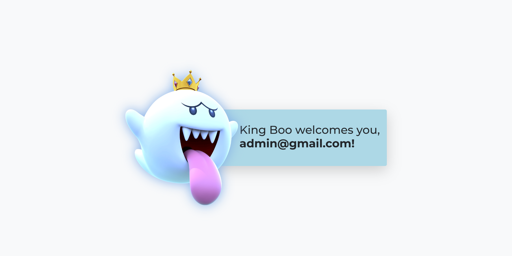
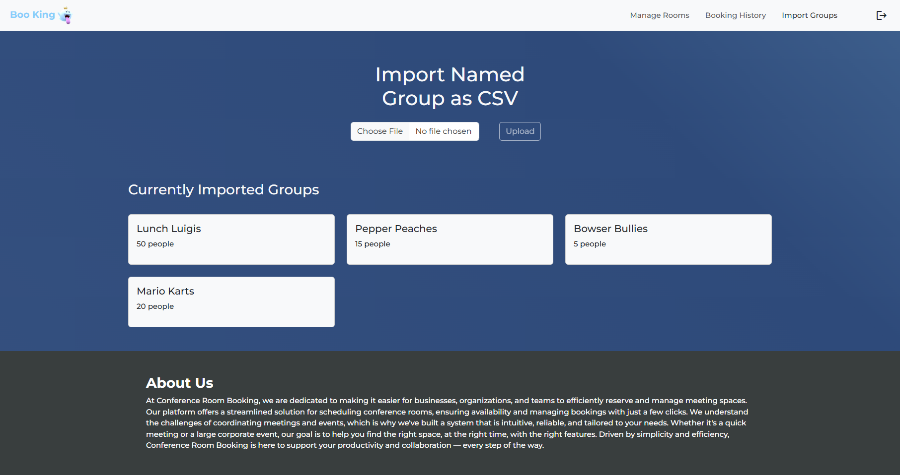
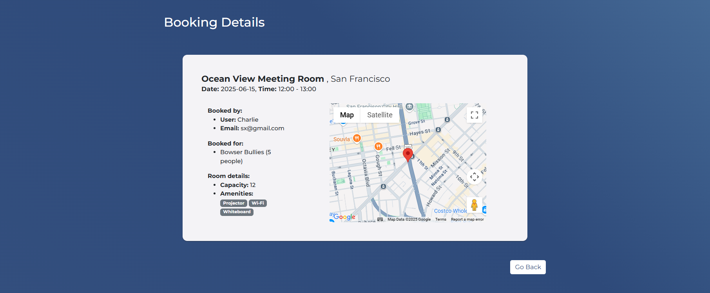
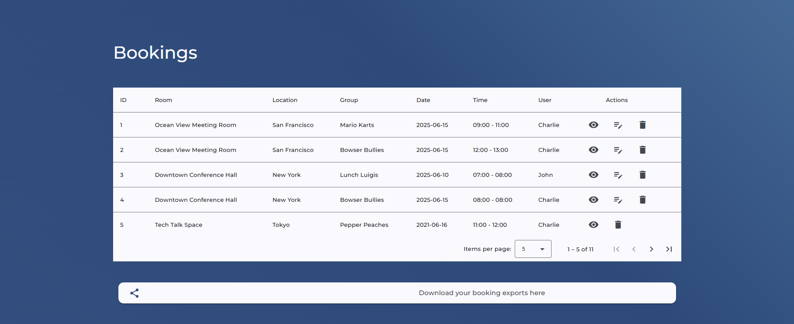

# Boo King
This is a full-stack Conference Room Booking application that allows employees to reserve meeting rooms, view availability, and manage their own bookings.

## Tech Stack

- **Backend**: Java, Spring Boot with JPA Hibernate & H2 (InMemory DB)
- **Frontend**: Signal-based Angular with Angular Material & Bootstrap5
- **Dockerized**: Backend, Frontend, and PostgreSQL (currently does not work)
- **Additional Services**: JWT Tokens, GoogleMapsApi, MinIO

---

## Features

### Simple, user friendly UI :)

---

---

### Authentication & Authorization
- User registration and login using email and password.
- JWT authentication for securing endpoints.
- Supports 2 different roles:
  - **USER**: Can view and book rooms. (default)
  - **ADMIN**: Can manage rooms and view all bookings. (currently hardcoded password = admin)
    
---

### Room Management (Admin Only)
- CRUD for Room entities: name, location, capacity, amenities.
- Address selection via Google Maps or manual city input.
- Address must appear as a point on a map.
- Validation:
  - Room name must be unique (isn't gracefully shown).
  - Capacity must be specified. (address isn't fixed yet)
- Room can be deleted only if it has no active bookings (isn't gracefully shown)
- Import **Named Groups of People** via CSV (Format: `Name,Number`).

---

---

### Booking Display with GoogleMapsApi
- Users can **create/update/delete** bookings
- Update works only by slot and for future bookings (will support room/date in the future!)
- Prevents overlapping bookings. (isn't gracefully shown)
- Validates that room capacity fits group size. (isn't gracefully shown)
- Role-based visibility:
  - Users see **their own** bookings.
  - Admins see **all** bookings.

---

---

### Availability View
- Toggle Calendar & Table view of daily room schedule.
- Reactive filtering with Signal Store
  - by Date -> Table View
  - by Room -> Calendar View (may support visual improvements in the future!)
  - by capacity, amenities..
- Available slots displayed as dynamic bars.
  
---

### Export Bookings to MinIO bucket
- Users can export **their bookings** as CSV.
- Export remains available via pre-signed URLs.
- Can download exported booking at any time.

---

---

### ./Backend
`mvn clean install`
`./mvnw spring-boot:run`
by default h2 settings and dbseeder

### ./Frontend
`cd frontend`
`npm install`
`ng serve`( or run_frontend from package.json)

### Utils
Backend uses JWT_SECRET as local environment variable for tokens
MinIO uses default credentials (minioadmin found in application.poperties) and must be running at localhost:9000
GoogleMaps uses a secret apiKey, not so secret mapId for map display and googleplacesapi for selecting address

